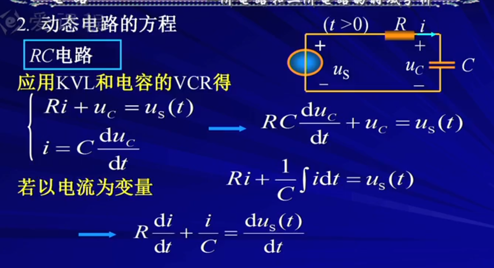
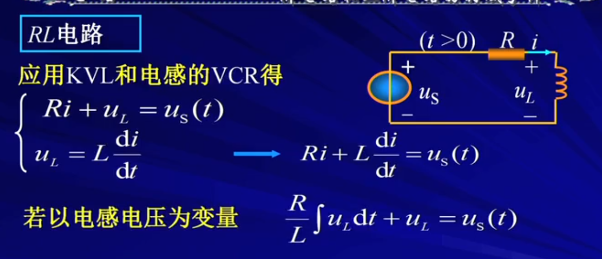
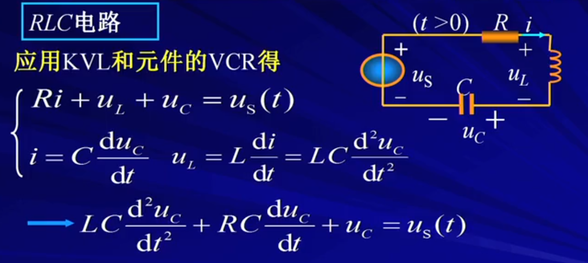

# 动态电路方程
> https://www.bilibili.com/video/BV1N8411N7oL

### RC电路
 

### RL电路

- 一般用第一个方程
- 因为只含有一个动态元件，因此被称为“一阶电路”。

### RLC电路

- 二阶常系数微分方程

**结论**：动态电路方程的阶数通常等于电路中动态元件的个数。但有的时候方程可以降阶。
- 当含有纯电容回路或纯电容**额定电压源**回路，因为有些电压/电容可以被其他元件表示，电路会降阶。
- 当含有纯电感的（起）结点或纯电感电流源（起）结点时，电路会降阶。因为有些电流可以被其他自由未知量表示。

## 电路的初始条件
- $t=0_{+}$ 与$t=0_{-}$ 分别表示换路前与换路后。连续函数有$f(0_{+})=f(0_{-})$
特征根方程用于求解**线性常系数微分方程**的通解，方法如下：

----------------------------
# 特征根方程
### 一、问题背景
给定一个线性常系数微分方程，例如：
\[
a_n \frac{{d^n y}}{{dx^n}} + a_{n-1} \frac{{d^{n-1} y}}{{dx^{n-1}}} + \dots + a_1 \frac{{dy}}{{dx}} + a_0 y = 0
\]
其中，\(a_0, a_1, \dots, a_n\) 是常数。

### 二、特征根方程的求法
1. **假设解形式**：设微分方程的解为指数函数形式：
   \[
   y = e^{\lambda x}
   \]
   将 \(y = e^{\lambda x}\) 代入微分方程，得到：
   \[
   a_n \lambda^n e^{\lambda x} + a_{n-1} \lambda^{n-1} e^{\lambda x} + \dots + a_1 \lambda e^{\lambda x} + a_0 e^{\lambda x} = 0
   \]
2. **提取指数函数**：因为 \(e^{\lambda x} \neq 0\)，所以可得：
   \[
   a_n \lambda^n + a_{n-1} \lambda^{n-1} + \dots + a_1 \lambda + a_0 = 0
   \]
   这就是**特征方程**。

### 三、根据特征根构造通解
解特征方程，得到特征根 \(\lambda_1, \lambda_2, \dots, \lambda_m\)（注意重根和复数根的处理）：
1. **不同实根**：如果特征根是互不相同的实数 \(\lambda_1, \lambda_2, \dots, \lambda_n\)，通解为：
   \[
   y = C_1 e^{\lambda_1 x} + C_2 e^{\lambda_2 x} + \dots + C_n e^{\lambda_n x}
   \]
2. **重根**：如果特征根 \(\lambda\) 是 \(k\) 重根，通解为：
   \[
   y = (C_1 + C_2 x + \dots + C_k x^{k-1}) e^{\lambda x}
   \]
3. **复数根**：如果特征根是共轭复数对 \(\lambda = \alpha \pm \beta i\)，通解为：
   \[
   y = e^{\alpha x} (C_1 \cos \beta x + C_2 \sin \beta x)
   \]
