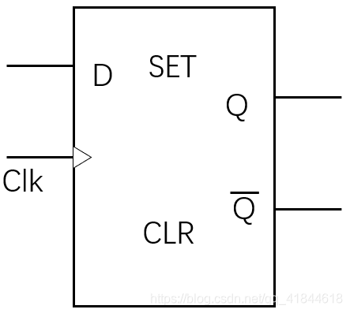
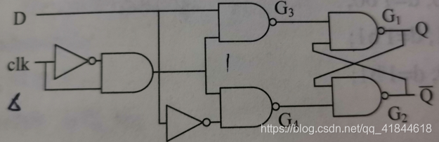

时序逻辑中为了响应不同的状态，需要对信号进行记忆。存储信号的电路常用的有锁存器（Latches）和D触发器（D-type Flip-Flop），前者使用时钟电平捕获信号，后者使用时钟沿捕获信号。对于使用时钟沿捕获数据的电路结构，同步系统中用Register表示，中文译为寄存器。因此，D触发器是寄存器的一种。
## 锁存器
```verilog
module d_latch(d,clk,q);
    input d;
    input clk;
    output q;
    reg q;
    always @ (d,clk)
        if(clk)
            q <= d;
endmodule
// TestBench
module d_latch_tb;
    reg clk,d;
    wire q;
    d_latch u1(.d(d),.clk(clk),.q(q));
    initial
    begin
        clk = 1;
        d <= 0;
        forever
        begin
            #60 d <= 1;//人为生成毛刺 
            #22 d <= 0;
            #2  d <= 1;
            #2  d <= 0;
            #16 d <= 0;//维持16ns的低电平，然后让它做周期性的循环
        end
    end
    always #20 clk <= ~clk;//半周期为20ns,全周期为40ns的一个信号
endmodule
```


## D触发器

上图中的小三角代表沿敏感

**原理：**在触发边沿到来时，将输入端的值存入其中，并且这个值与当前存储的值无关。在两个有效的脉冲边沿之间，D的跳转不会影响触发器存储的值，但是在脉冲边沿到来之前，输入端D必须有足够的建立时间，保证信号稳定。

```verilog
module d_flip_flop_rst(
    input d, clk, rst,
    output reg q);
    always @ (posedge clk,posedge rst)
    begin
        if(rst)//异步复位信号，跟时钟沿无关，只要复位是高电平就会复位
            q <=0;
        else
            q <= d;//上升沿有效的时候，把d捕获到q
    end    
endmodule
```
门级建模
```verilog
`timescale 1ns/1ns
module d_flip_flop(
	input D, clk,
	output Q);
	wire nclk, nD, nQ;
	assign #2 nclk = ~clk;
	assign    nD   = ~D;
	wire 	w1,w3,w4;
	and		U0(w1,clk,nclk);
	nand	U3(w3,D,w1),
			U4(w4,nD,w1),
			U1(Q,w3,nQ),
			U2(nQ,Q,w4);
endmodule
module d_flip_flop_tb();
	reg clk,d;
	wire q;
	initial begin
		clk = 0;
		forever begin
			#30 clk = ~clk;
		end
	end
	initial begin
		repeat(6) begin
			#60 d <= 1;
            #22 d <= 0;
            #2  d <= 1;
            #2  d <= 0;
            #16 d <= 0;
		end
		$finish;
	end
	d_flip_flop D(
		.D(d), .clk(clk), .Q(q)
	);
endmodule
```
### 二进制的计数器
```v
module count();
	reg clk,d;
	wire q, nq;
	initial begin
		clk = 0;
		repeat(6) begin
			#30 clk = ~clk;
		end
		$finish;
	end
	
	d_flip_flop D(
		.D(nq),
		.clk(clk),
		.Q(q),
		.nQ(nq)
	);
endmodule
```

## T触发器
逻辑功能：当时钟的有效边沿到来时，如果T=1，则触发器反转；如果T=0，则触发器的状态保持不变。R为复位端，异步复位，低电平有效。
```v
module t(clk,rst,T,Q);
	input clk,rst,T;
	output reg Q; // 具有驱动能力
	always@(posedge clk or negedge rst)
	begin	
		if(!rst) 
			Q<=1'b0;
		else if(T) 
			Q<=~Q;
		else 	
			Q<=Q;
	end
endmodule 
```
