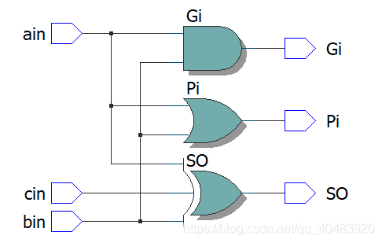
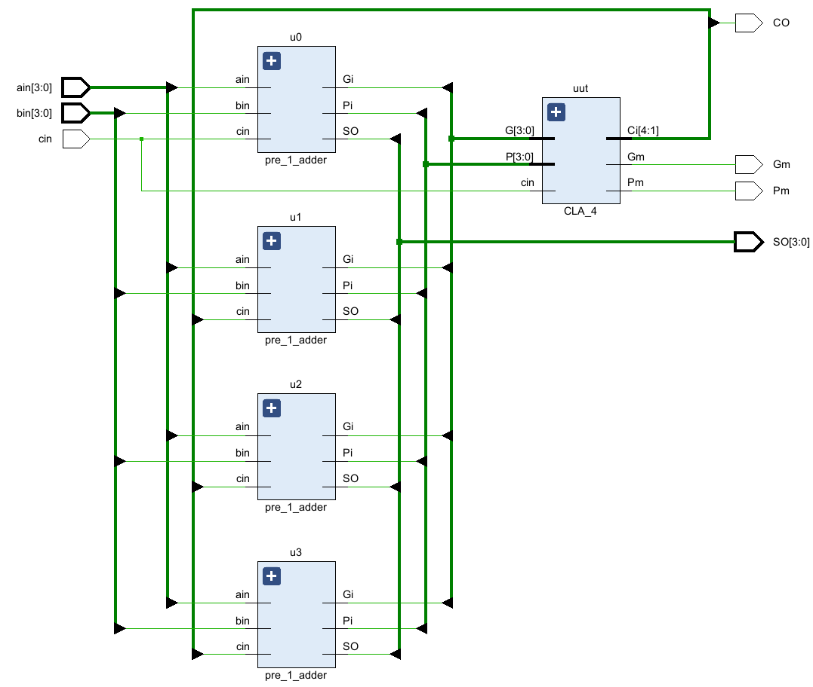

## 原理
超前进位加法器是一种告诉加法器，每级进位由附加的组合电路产生。高位的运算不需等待低位运算完成，因此可以提高运算速度。

对于输入信号位宽为 $N$ 的全加器，其进位信号是 $C_{OUT} = C_N$

输出的加法结果是：$S_{n-1}=P_{n-1} \oplus C_{n-1} \quad n \in [n,1]$ 

超前进位标志信号是：
$$\begin{aligned}C_n&=G_{n-1}+P_{n-1}C_{n-1}\quad n \in [n,1]\\
C_0&=C_{in}
\end{aligned}$$
进位产生函数是：
$$G_{n-1}=A_{n-1}B_{n-1}\quad n \in [n,1]$$
进位传输函数是：
$$P_{n-1}=A_{n-1}\oplus B_{n-1}\quad n \in [n,1]$$
当 $N=4$ 时，由公式得：
\[
\begin{aligned}
C_1 &= G_0 + P_0 C_0 \\
C_2 &= G_1 + P_1 C_1 = G_1 + P_1 (G_0 + P_0 C_0) \\
C_3 &= G_2 + P_2 C_2 = G_2 + P_2 (G_1 + P_1 (G_0 + P_0 C_0)) \\
C_4 &= G_3 + P_3 C_3 = G_3 + P_3 (G_2 + P_2 (G_1 + P_1 (G_0 + P_0 C_0)))
\end{aligned}
\]

### 1位超前进位加法器
```verilog
module pre_1_adder(
	input	ain,bin,cin,
	output	SO,Gi,Pi
	);
	assign Gi = ain & bin;
	assign Pi = ain | bin;
	assign SO = ain ^ bin ^ cin;
endmodule
```


### 4位超前进位加法器
```verilog
module pre_4_adder(
	input[3:0] 	ain,bin,
	input		cin,
	output[3:0]	SO,
	output		Pm,
	output 		Gm,
	output 		CO
);
	wire[4:1]	CI;
	wire[3:0]	Pi;
	wire[3:0]	Gi;
	pre_1_adder u0(
		.ain		(ain[0]),
		.bin		(bin[0]),
		.cin		(cin),
		.SO			(SO[0]),
		.Gi			(Gi[0]),
		.Pi			(Pi[0])
		);
	pre_1_adder u1(
		.ain		(ain[1]),
		.bin		(bin[1]),
		.cin		(CI[1]),
		.SO			(SO[1]),
		.Gi			(Gi[1]),
		.Pi			(Pi[1])
		);
	pre_1_adder u2(
		.ain		(ain[2]),
		.bin		(bin[2]),
		.cin		(CI[2]),
		.SO			(SO[2]),
		.Gi			(Gi[2]),
		.Pi			(Pi[2])
		);
	pre_1_adder u3(
		.ain		(ain[3]),
		.bin		(bin[3]),
		.cin		(CI[3]),
		.SO			(SO[3]),
		.Gi			(Gi[3]),
		.Pi			(Pi[3])
		);
	CLA_4 uut(
		.P			(Pi),
		.G			(Gi),
		.cin		(cin),
		.Ci			(CI),
		.Gm			(Gm),
		.Pm			(Pm)
	);
	assign CO = CI[4];
endmodule

module CLA_4(
		input 	[3:0]		P,
		input 	[3:0]		G,
		input 				cin,
		output 	[4:1]		Ci,
		output 				Gm,
		output 				Pm
	);
	assign Ci[1]=G[0]|P[0]&cin; // 前面提到的公式，用来对Ci[4:1]进行计算
	assign Ci[2]=G[1]|P[1]&G[0]|P[1]&P[0]&cin;
	assign Ci[3]=G[2]|P[2]&G[1]|P[2]&P[1]&G[0]|P[2]&P[1]&P[0]&cin;
	assign Ci[4]=G[3]|P[3]&G[2]|P[3]&P[2]&G[1]|P[3]&P[2]&P[1]&G[0]|P[3]&P[2]&P[1]&P[0]&cin;

	assign Gm=G[3]|P[3]&G[2]|P[3]&P[2]&G[1]|P[3]&P[2]&P[1]&G[0]; 
		// 整个加法器的 进位生成信号，它通过递归地组合每一位的生成信号和传播信号来计算	
	assign Pm=P[3]&P[2]&P[1]&P[0];	// 整个加法器的 进位传播信号，当每一位的传播信号都为 1 时，
									// 表示进位信号能够完全传播。
endmodule
```
