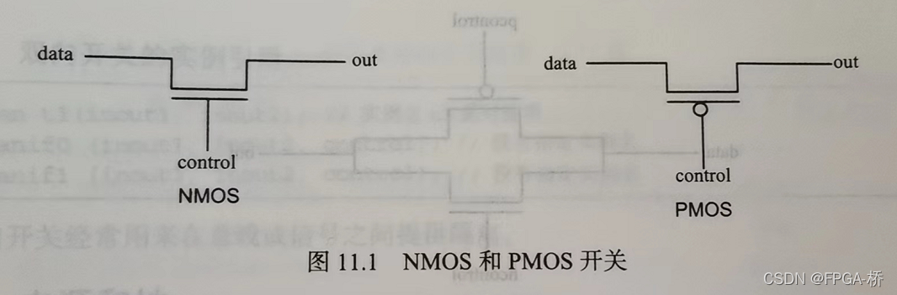
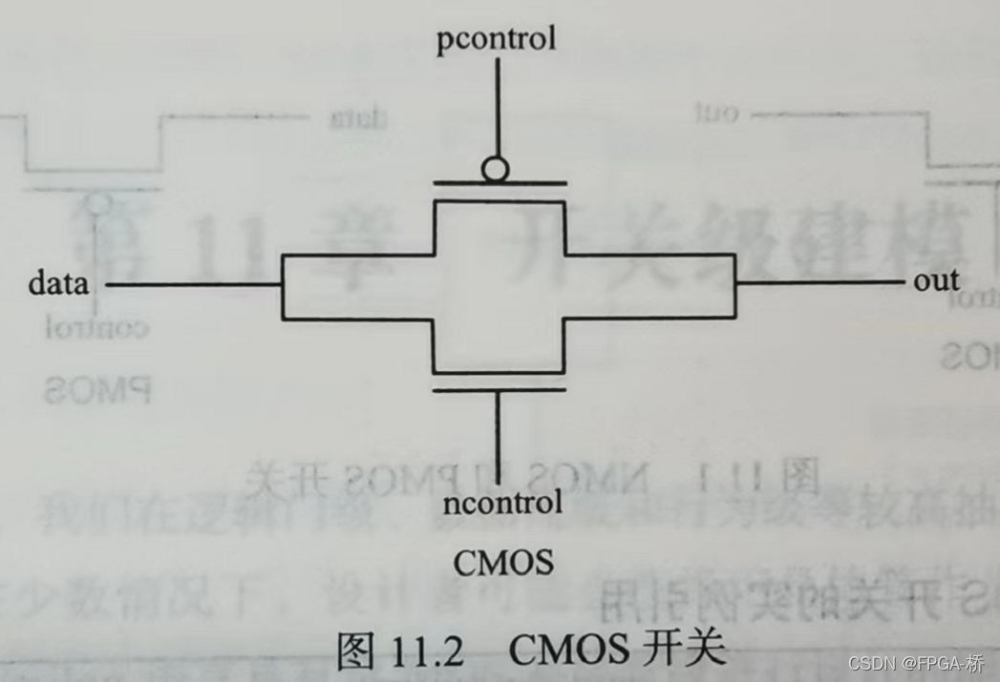
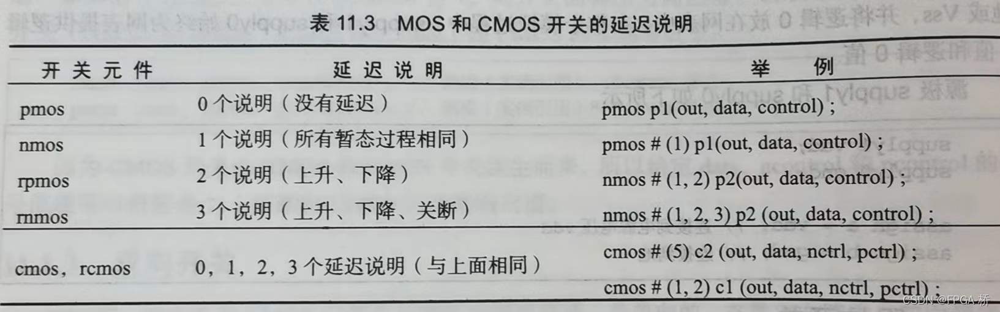
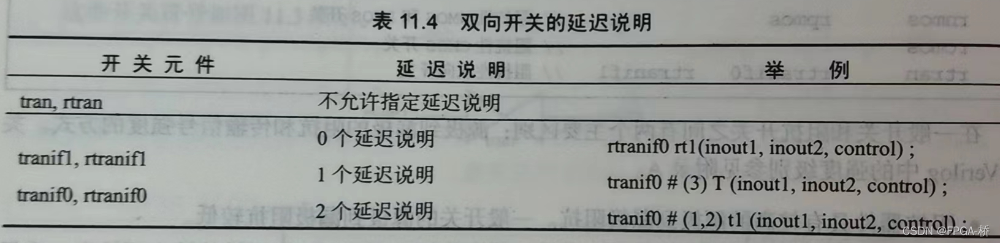
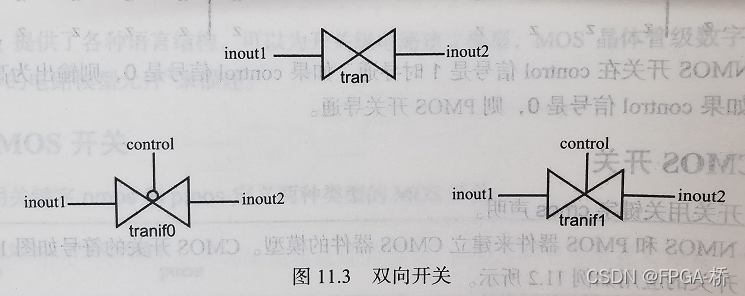
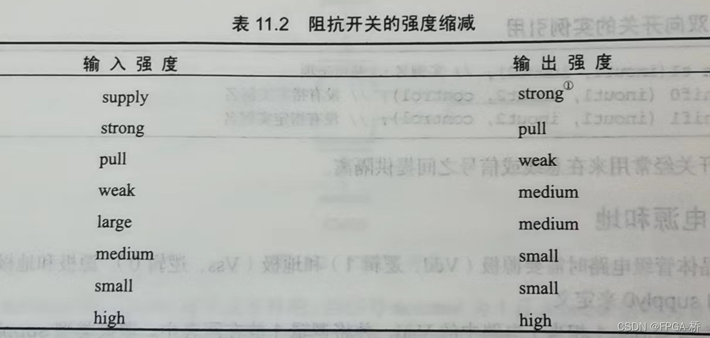

# CMOS 开关

## nmos和pmos

类型：
- `nmos`（N 类型 MOS 管）   
- `pmos`（P 类型 MOS 管）  
- `rnmos`（带有高阻抗的 NMOS 管） 
- `rpmos`（带有高阻抗的 PMOS 管）

实例化：`xmos c1(out, data, control)`

`nmos`真值表：
| data\control | 0   | 1   | x   | z   |
| -----------: | --- | --- | --- | --- |
|            0 | z   | 0   | L   | L   |
|            1 | z   | 1   | H   | H   |
|            x | z   | x   | x   | x   |
|            z | z   | z   | z   | z   |

`pmos`真值表：
| data\control | 0   | 1   | x   | z   |
| -----------: | --- | --- | --- | --- |
|            0 | 0   | z   | L   | L   |
|            1 | 1   | z   | H   | H   |
|            x | x   | z   | x   | x   |
|            z | z   | z   | z   | z   |

- 逻辑表中符号L代表0或z，H代表1或z。
- 这里不区分源极和漏极。
  

## cmos

实例化：`cmos c1(out, data, ncontrol, pcontrol);`

真值表：
| Ctrl (NMOS Gate) | Ctrl̅ (PMOS Gate) | NMOS 状态 | PMOS 状态 | 开关状态 | 功能描述         |
| ---------------- | ---------------- | --------- | --------- | -------- | ---------------- |
| 0                | 1                | 截止      | 截止      | 关断     | 信号无法通过开关 |
| 1                | 0                | 导通      | 导通      | 闭合     | 信号可以双向传输 |
```verilog
module cmos_switch (
    input wire in,         // 输入信号
    input wire ctrl,       // 控制信号
    output wire out        // 输出信号
);
    wire ctrl_n;           // 反相的控制信号
    assign ctrl_n = ~ctrl; // 生成反相控制信号

    // CMOS Transmission Gate 实现
    cmos (out, in, ctrl, ctrl_n);

endmodule
```
#### 延迟说明
- MOS和CMOS开关：

- 双向传输开关：
这种开关在传输信号时没有时延，但是当**开关值切换**时有开关时延。

- **导通延迟** (turn-on delay)：
  从传输门的控制信号有效（tranif0 中 control = 0，tranif1 中 control = 1）到信号开始传输之间的时间。
- **关断延迟** (turn-off delay)：
  从传输门的控制信号无效到信号传输终止（输出进入高阻态 Hi-Z）之间的时间。
- **传播延迟** (signal propagation delay)：
  从输入信号变化到输出信号变化所需的时间。

		当只有一个延迟参数时，该参数同时表示三者。
		当只有两个延迟参数时，传播延迟 = 导通延迟。
# 双向开关(tran)

定义：
- `tran`:作为信号inout1和inout2之间的缓存，inout1和inout2都可以是驱动信号。
  - 无任何控制信号，两个端口总是直接连接。
- `tranif0`：当control为0时，inout1和inout2进行连接
- `tranif1`：当control为1时，inout1和inout2进行连接

实例化：
```verilog
tran t1(inout1, inout2);
tranif0 t2(inout1, inout2, control);
tranif1 t3(inout1, inout2, control);
```
## 阻抗开关
**定义：**在之前的mos管的关键字前加入字母r，表示成阻抗开关，比一般的开关具有更高的源极到漏极的阻抗，且在通过它们传输时减少了信号强度。

**RCMOS：** 与 nmos 类似，但 rnmos 是带弱恢复（resistive pull-up/down）特性的 NMOS 晶体管。

| 特性         | 普通 NMOS          | RNMOS              |
| ------------ | ----------------- | ------------------ |
| 源漏间电阻   | 低                 | 高                 |
| 驱动能力     | 强                 | 弱                 |
| 用途         | 驱动信号、高速切换 | 弱恢复、低功耗稳定 |
| 对节点的影响 | 快速改变电压       | 缓慢拉高或拉低电压 |
- 阻抗器件具有较高的源极到漏极阻抗。一般开关阻抗较低
- 阻抗开关在传递时减少了信号强度。

**工作原理：**
- 如果控制信号为低电平（0），虽然晶体管不会导通，但输出端可能通过弱恢复特性（弱驱动）回到默认状态。
- 主要用于模拟一些具有电阻特性的 NMOS 晶体管行为。
##### 信号强度说明

输入信号强度从高到低依次是：
1. **supply**：表示电源信号，强度最高。例如 \(V_{DD}\) 和 \(GND\)。
2. **strong**：表示普通的强驱动信号，常用于大多数逻辑门输出。
3. **pull**：表示弱上拉或下拉信号（通常通过小电阻实现）。
4. **weak**：表示非常弱的驱动信号，类似浮空节点的轻微影响。
5. **large、medium、small、high**：这几个信号强度进一步降低，可能在特定模拟或特殊用途场景中使用。


# 电源和地
定义：晶体管中的源极（Vdd，1）和地级（Vss，0）分别用关键字`supply1`和`supply0`来定义。
```verilog
//实例化
supply1  vdd;
supply0  vss;
//变量的连接
assign a = vdd;
assign b = vss;
```
