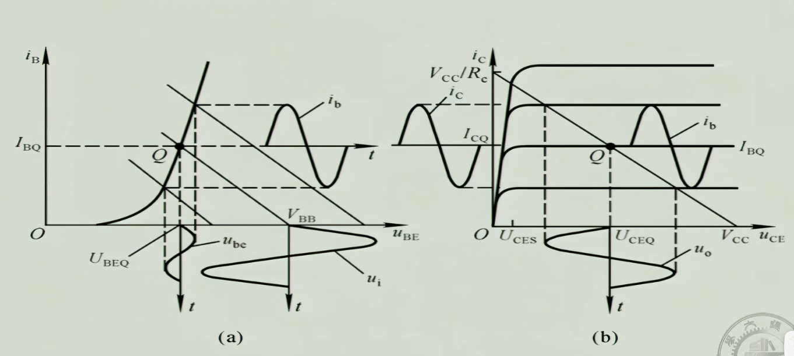
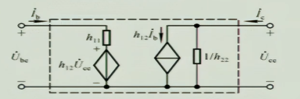
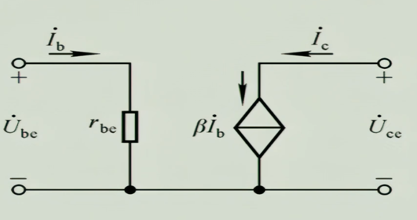
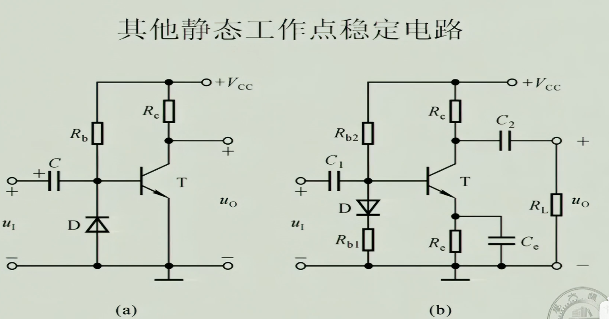

# H参数等效模型
由方程（晶体三极管输入和输出特性曲线）有:
$$\begin{aligned}
	u_{BE} &= f(i_B, u_{CE}) \\
	i_c    &= f(i_B, u_{CE})
\end{aligned}$$

$$\begin{aligned}
	\Delta u_{BE} &= h_{11} \Delta i_B+h_{12} \Delta u_{CE} \\
	\Delta i_c    &= h_{21} \Delta i_B+h_{22} \Delta u_{CE} 
\end{aligned}$$

- 当 $U_{CE} > 1V$ 时，$h_{12}$ 可以忽略。
- $h_{11} = r_{BE}$，对于一个小信号模型，$
r_{be} = \frac{V_T}{I_B}
$（$V_T$ 为热电压（室温26mV）。
- $h_{21}$ 就是之前推出的 $\beta$。
- $h_{22}$ 在导通区可以认为无穷大。

### 简化的H参数

