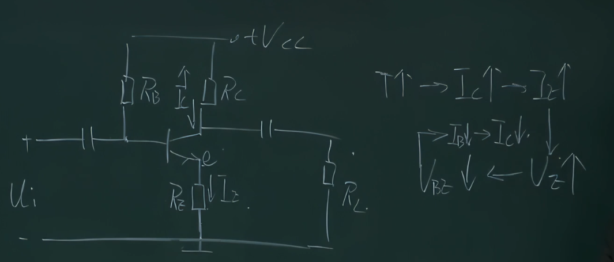
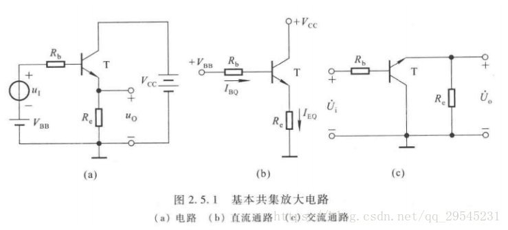
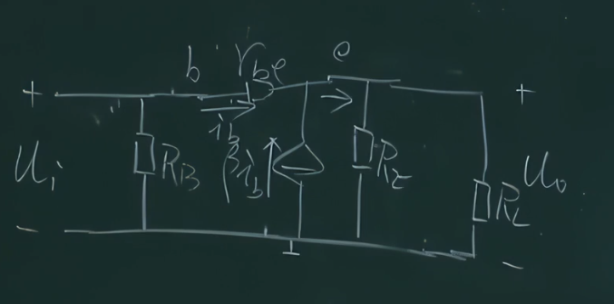

- 对Q点的影响因子主要是**温度**
## 稳定Q点（$I_c$）的思路

增加 $R_E$，可以在 $I_C$ 增加时抬高 $U_e$ 的电位 （反馈）

----------------------------------
## 放大电路的三种接法
### 基本共集放大电路

$$A_u=\frac{U_O}{U_I} = 
\frac{(1+\beta)i_bR_E//R_L}{(1+\beta)i_bR_E//R_L+i_br_{BE}} \to 1^-$$
- 电压相等，电流放大
$$\begin{aligned}
	R_i&=r_{BE}+(1+\beta)R_E//R_L \\
	R_o&=\frac{U_o}
	{\frac{U_o}{R_e}+(1+\beta)\frac{U_o}{r_{BE}}} \\
	&=R_e//\frac{r_{BE}}{1+\beta}
\end{aligned}$$
- 输出电阻很小，因为 $R_e$ 很小

### 基本共基放大电路
- 只能放大电压，不能放大电流。
- 输入电阻小，电压放大倍数、输出电阻与共射电路相当。
- 高频特性好。