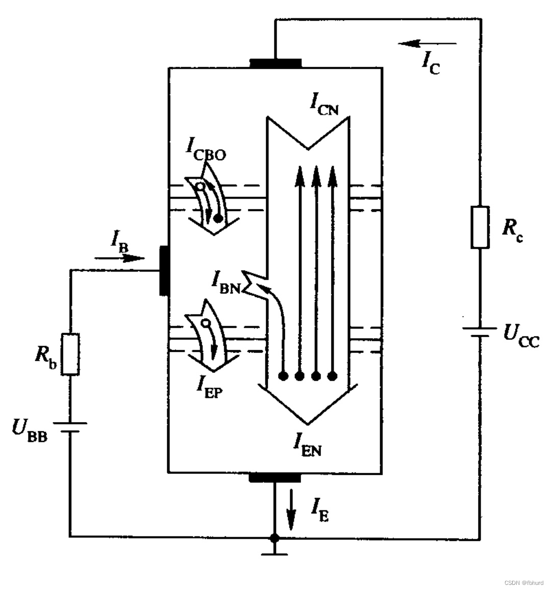
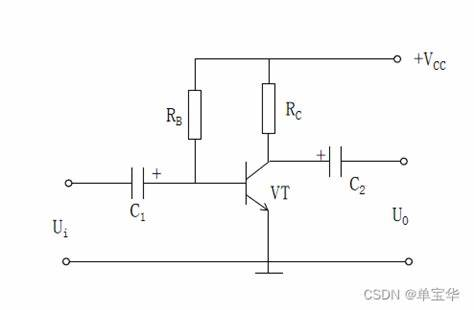
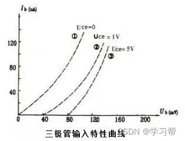
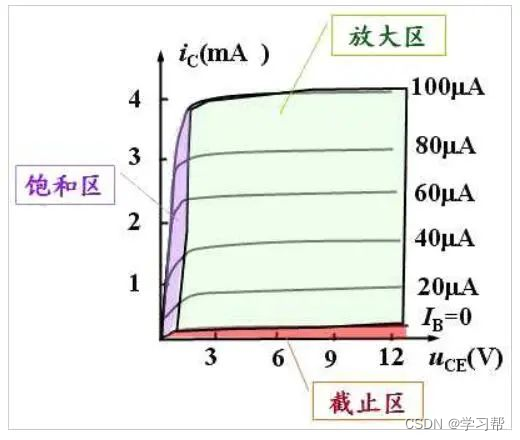

# 晶体三极管
回顾：半导体二极管的特性: $i=I_S(e^{\frac{u}{U_T}}-1)$
## 晶体管的电流放大作用

- $I_{EN}$ 由发射区向基区扩散的电子电流
- $I_{EP}$ 由基区向发射区扩散的空穴电流
- $I_{BN}$ 基区内复合运动所形成的电流（扩散到基区但未被符合的自由电子）
- $I_{CN}$ 漂移至集电区形成的电流
- $I_{CBO}$ 平衡少子在集电区和基区之间的漂移运动形成的电流。

有：
$$
\begin{aligned}
	I_E &= I_{EN}+I_{EP} = I_{CN}+I_{BN}+I_{EP} \\
	I_C &= I_{CN}+I_{CBO} \\
	I_B &= I_{BN}+I_{EP}-I_{CBO}
\end{aligned}
$$

## 输入输出特性曲线
#### 输入特性曲线
当 $U_{CE}$ 不变时，输入电流（$I_b$）和输入电压（$U_{BE}$）间的关系。

- 应当满足二极管特性。
- 当 $U_{CE}$ 变大时，因为由发射区到基区的非平衡少子更多的进入到集电极，所以 $i_b$ 相对更小。
- 随着 $U_{CE}$ 增大，晶体管的工作更偏向于线性区域（放大区），此时的输入电流（基极电流）更多地由输入信号决定，而不是由 $U_{CE}$ 直接控制。

#### 输出特性曲线

当基极电流 $i_B$ 不变时，集电极电流 $I_c=f(u_{CE})$
四种偏置方式：

| 发射结 | 集电结 | 工作状态 |
| ------ | ------ | -------- |
| 正偏   | 反偏   | 放大     |
| 正偏   | 正偏   | 饱和     |
| 反偏   | 反偏   | 截止     |
| 反偏   | 正偏   | 倒置     |

- 截止区：发射结电压小于开启电压（因此 $I_B$ 很小）且集电极反向偏置。
- 放大区：发射结正向偏置，此时 $I_C=\~\beta I_B, \Delta i_c=\beta i_B$
- 饱和区：发射结与集电结都正向偏置，三极管属于导通状态。

### 电压放大倍数
$$\.A_u=\frac{\.U_o}{\.U_i}=-\frac{\beta R_c}{R_b+r_{be}}$$
### 输入电阻和输出电阻(共射)
- 输入电阻：$R_i=\frac{U_i}{I_i}=R_b+r_{BE}$
- 输出电阻（使用诺顿定理将放大电路进行等效变换）：$R_o=\frac{U_o}{I_c}$
## 温度的影响
- $I_{CBO}$ 增大，因为少子浓度增大。
- $\beta$ 增大。因为温度升高，BJT内载流子的扩散能力增强，使基区内载流子的复合作用减小。
- **输入特性**曲线左移（输入电流变大）
- **输出特性**曲线上移。随着温度升高，基极-发射极结的正向电压（V_BE）下降，导致基极电流（I_B）增加，从而使集电极电流（I_C）增大。