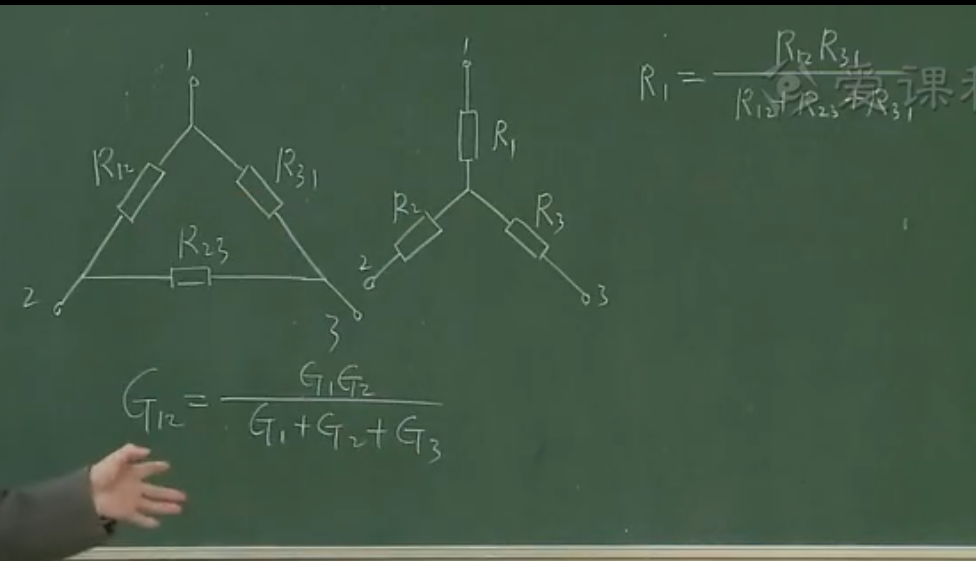

# 电容元件
>https://www.bilibili.com/video/BV1N8411N7oL

**定义：** 储存电荷的元件，任何时刻可以用$f(u,q)=0$ 描述。

线性时不变元件电压与电流的关系: $I=C\frac{dU}{dt}$

电压与电流的积分关系：
$$u(t)=\frac{1}{C}\int_{-\infty}^t i(t)dt$$

电容的功率：
$$P=ui=uC\frac{dU}{dt}$$
- 当$du/dt>0$时，$i>0$
- 当$du/dt<0$时，$i<0$
- 电压不能跃变

电容的储能：
$$W(t)=\int_{t_0}^t Cu\frac{du}{dt}dt = \frac{1}{2}Cu^2(t)$$

实际电容器模型含有一个电阻（甚至有电感效应）

# 电感元件
磁通量：$\Psi(t)=N\Phi(t)$

**定义：** 储存磁能的两端元件.任何时刻特性可用$f(\Psi,i)=0$表述.

线性时不变电感元件: $\Psi(t)=Li(t)$

电感元件的自感:
$$u(t)=\frac{d\Psi}{dt}=L\frac{di(t)}{dt}$$
- 当电流增加时,电压$>0$.
- 电压方向和感应电动势方向相反.
**感应电动势是从低电位指向高电位, 电压从高电位指向地电位.**
- $d\Psi$ 和 $i$ 满足右手螺旋定则.
- 电流不能跃变

积分关系式
$$i(t)=\frac{1}{L}\int_{-\infty}^tu(t)dt$$

电感的功率:
$$p=ui=L\frac{di}{dt}i$$
- 当电流增大,$p>0$,电感吸收功率
- 当电流减小,$p>0$,电感释放功率

电感的储能:
$$W(t)=\int_{-\infty}^t Li\frac{di}{dt} = \frac{1}{2}Li^2(t)$$

- 实际电感线圈的模型: 含有电阻(甚至电容)

# 电容、电感元件的串并联
### 1. 电容的串联
等效电容：$C = C1//C2$

串联分压：分压与电容大小成**反比**
### 2. 电容的并联
等效电容：$C = C1+C2$

并联分流：分流与电容大小成**正比**
### 3. 电感的串联
等效电感：$L = L1+L2$

串联分压：电压与电感大小成**正比**
### 4. 电感的并联
等效电感：$L = L1//L2$

并联分流：分流与电感大小成**反比**

## 例子
**（电感/电阻）三角形电路与Y型电路的相互转换**

- 电导：$G=1/R$ 
- **电感：**可以把 $R$ 理解为 $L$，把 $G$ 理解为 $1/L$.
- **电容：**可以把 $R$ 理解为 $1/C$, 把 $G$ 理解为 $C$.

