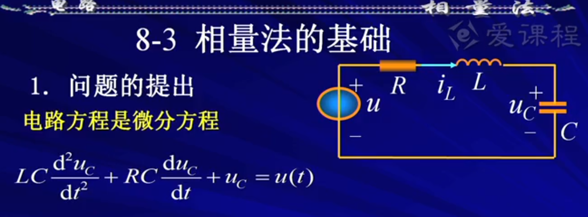

# 电路定律的向量形式
> https://www.bilibili.com/video/BV1N8411N7oL

要求:
- 所有的激励都是正弦量
- 所有的元件都为线性
- 电路达到稳态

**电阻元件的VCR的向量形式**
- $i(t)=\sqrt{2}Icos(\omega t+\phi)$
- $u_R(t)=\sqrt{2}RIcos(\omega t+\phi)$
- 向量关系：$\.U=R\.I$
瞬时功率:
- $p_R=U_RI[1+cos2(\omega t+\phi)]$  
 

**电感元件的VCR的向量形式**
- $i(t)=\sqrt{2}Icos(\omega t+\phi)$
- $u_L(t)=\sqrt{2}\omega L Icos(\omega t+\phi+\frac{\pi}{2})$
- 向量关系：$\.U_L=jwL\.I=jX_L\.I$
  - 感抗：$X_L=\omega L=2\pi fL$，单位为 $\Omega$ 欧姆。
  - 感纳：$B_L=-1/(\omega L)=-1/2\pi fL$，单位为 $S$ 西门子。

**电容元件的VCR的向量形式**
- $u(t)=\sqrt{2}Ucos(\omega t+\phi)$
- $i(t)=\sqrt{2}\omega CUcos(\omega t+\phi + \frac{\pi}{2})$
- 向量关系：$\.U=-j\frac{1}{\omega C}\.I=jX_C\.I$